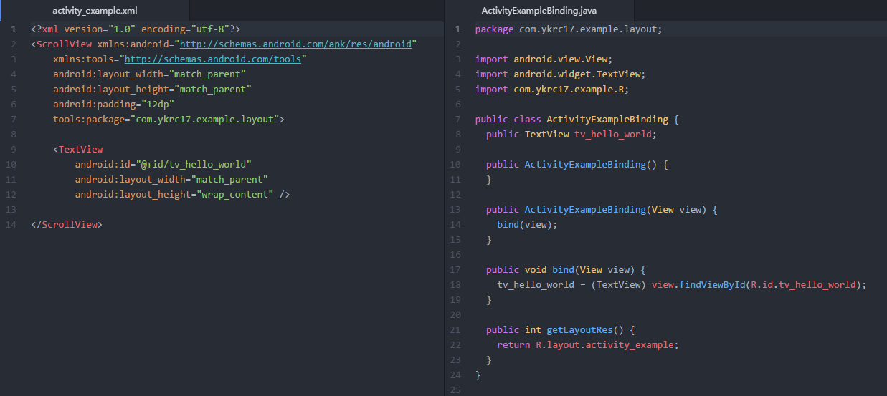

## Kizuna
> 嗨，多磨。我是View绑定生成工具KizunaAndroid  

本项目的目的是把开发人员从`findViewById`的地狱中拯救出来  
View绑定的代码编写机械重复、维护困难，完全可以由代码生成（或者让实习生去写

本项目有以下特点
- 有效减少代码编写量 <font color=gray>因为是Java代码生成器</font>
- 支持Java <font color=gray>因为是Java代码生成器</font>
- 如果哪天不想用了，移除成本极低 <font color=gray>因为是Java代码生成器</font>

## 示例

> 左边是xml，右边是生成代码

## 使用
```
施工中
```

## TODO
- R文件包名读取
- 自定义view attr
- IDEA插件

## 竞品分析（笑
说是竞品，其实Kizuna也就自己用用，不打算传播。  
说一下ButterKnife和kotlin-android-extensions为什么让我不爽

**ButterKnife**
- 并没有减少代码量，只不过把方法`findViewById`改成了`BindView`注解，减少代码量需要通过IDEA插件
- 粒度太粗，绑定一整个View容器，不灵活
- 对项目侵入大。一旦使用，很难从项目中去除
- 注解的值必须是常量，但是子模块中的`R.layout.xxx`并不是常量，支持较差
- annotationProcessor影响编译性能

**kotlin-android-extensions**
- 有效减少了代码
- 不支持Java，项目中的老代码不支持
- 对项目侵入大。一旦使用，很难从项目中去除
- 虽然支持原生的View容器，但是自定义View容器比如`ViewHolder`和`ViewModel`需要做额外处理
- kapt影响编译性能

**分析得出结论**
- 需要有效减少代码量
- 需要支持Java
- 需要支持自定义View容器（`ViewHolder`或`ViewModel`）
- 需要对项目侵入小

其实是有符合要求的，就是那个生成ButterKnife代码的那个IDEA插件。如果他能生成Java代码我就满足了。